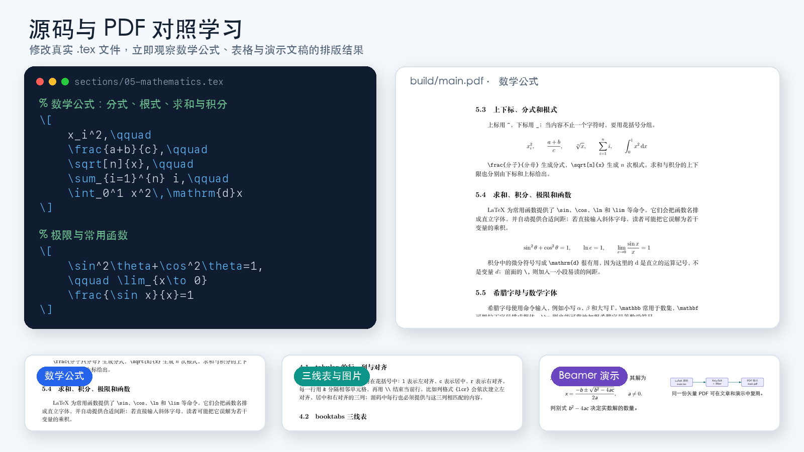
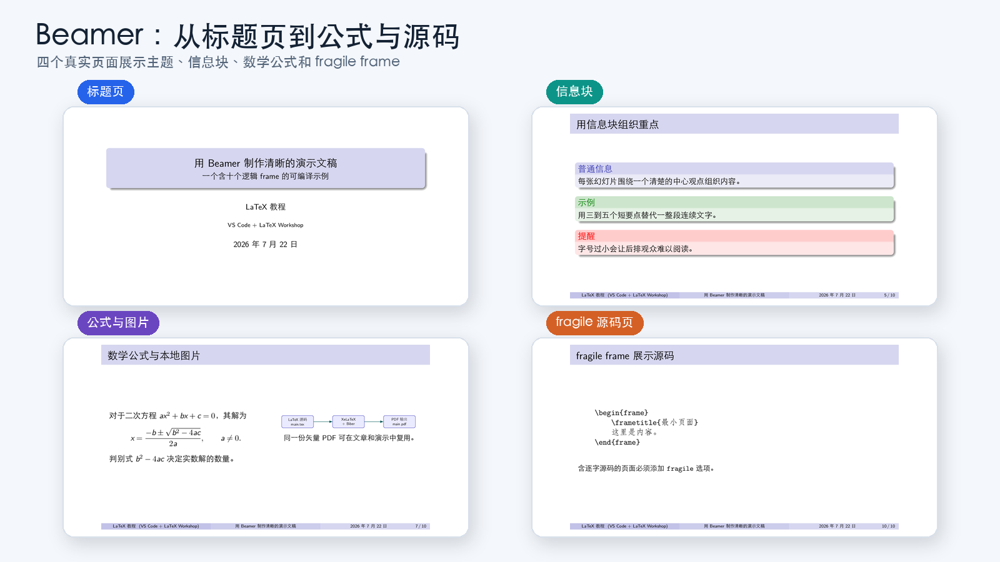

# LaTeX 中文实战教程：从第一份文档到数学公式与 Beamer

> 一个面向中文初学者的可编译 LaTeX 项目：从第一份中文文档出发，逐步掌握文字排版、数学公式、三线表、图片、定理、参考文献、多文件项目与 Beamer 演示文稿。

[](https://github.com/Tamarisk-Du/latex-tutorial/actions/workflows/build.yml)
[](https://github.com/Tamarisk-Du/latex-tutorial/releases/latest)
[](LICENSE-CONTENT)
[](LICENSE-CODE)

<p align="center">
  <a href="https://github.com/Tamarisk-Du/latex-tutorial/releases/latest/download/latex-tutorial.pdf"><strong>查看教程 PDF</strong></a>
  ·
  <a href="https://github.com/Tamarisk-Du/latex-tutorial/releases/latest"><strong>下载最新 Release</strong></a>
  ·
  <a href="https://github.com/Tamarisk-Du/latex-tutorial/releases/latest/download/beamer-demo.pdf"><strong>查看 Beamer 示例</strong></a>
</p>

<p align="center">
  
</p>

## 项目亮点

- **边读边改**：八个章节都是真实的 `.tex` 文件，可以直接修改并重新编译。
- **源码与效果对照**：在 VS Code 左侧阅读源码，在右侧查看对应 PDF。
- **面向中文写作**：使用 XeLaTeX 与 `ctex`，覆盖常见中文排版需求。
- **从文章到演示**：同时提供 31 页文章教程、最小中文示例和独立 Beamer 示例。
- **不仅展示正确写法**：章节包含学习目标、常见错误、彩色提示框与章末检查。
- **持续验证**：GitHub Actions 会编译三个入口，确保仓库中的示例保持可用。

## 适合谁

本项目面向希望使用中文系统学习 LaTeX 的初学者，尤其适合：

- 第一次接触 LaTeX，希望理解“源码如何变成 PDF”的读者；
- 需要完成课程报告、数学作业或实验报告的学生；
- 希望使用 LaTeX 撰写论文、研究报告或管理参考文献的读者；
- 希望用 Beamer 制作课程演示、学术报告或答辩幻灯片的人。

不要求提前掌握复杂的编程知识。你只需要能够使用 VS Code，并愿意一次修改一个地方，再对照源码和 PDF 观察结果。

## 三步快速开始

### 1. 准备环境

安装 TeX Live、MacTeX 或 MiKTeX，并确认终端能够运行 `latexmk`、`xelatex` 和 `biber`。详细步骤见[安装与编译](docs/installation.md)。

### 2. 获取项目

```bash
git clone https://github.com/Tamarisk-Du/latex-tutorial.git
cd latex-tutorial
```

### 3. 编译完整教程

```bash
latexmk -xelatex -synctex=1 -interaction=nonstopmode -file-line-error -outdir=build main.tex
```

完成后打开 `build/main.pdf`。如果暂时不想安装环境，可以直接下载[最新教程 PDF](https://github.com/Tamarisk-Du/latex-tutorial/releases/latest/download/latex-tutorial.pdf)。

## 八章学习路线

| 章节 | 学习内容 | 完成后能够 |
| --- | --- | --- |
| 01 | 安装、编译与预览 | 编译第一份中文 LaTeX 文档 |
| 02 | 文档结构 | 理解导言区、正文与章节层级 |
| 03 | 文字排版 | 设置强调、列表、段落与特殊字符 |
| 04 | 表格与图片 | 制作三线表并插入、引用图片 |
| 05 | 数学公式 | 输入分式、积分、矩阵与分段函数 |
| 06 | 定理与参考文献 | 使用定理环境、标签、引用和 Biber |
| 07 | 大型项目 | 使用根文件和 `\input` 拆分文档 |
| 08 | Beamer | 制作结构清晰的学术演示文稿 |

推荐依次学习 01 到 06 章，再通过第 07 章理解多文件结构，最后阅读第 08 章和独立的 `beamer-demo.tex`。

## 先看 Beamer 效果

<p align="center">
  
</p>

完整演示可从 [Release 页面](https://github.com/Tamarisk-Du/latex-tutorial/releases/latest)下载，也可以在本地编译 `beamer-demo.tex`。

## 安装说明

| 系统 | 推荐发行版 | 编辑器 |
| --- | --- | --- |
| macOS | MacTeX | VS Code + LaTeX Workshop |
| Windows | TeX Live 或 MiKTeX | VS Code + LaTeX Workshop |
| Linux | TeX Live | VS Code + LaTeX Workshop |

完整的安装、PATH 检查、VS Code 配置和清理命令见 [`docs/installation.md`](docs/installation.md)。遇到缺少命令、宏包、字体、Biber 或 SyncTeX 问题时，先查看 [`docs/troubleshooting.md`](docs/troubleshooting.md)。

## 三个可编译入口

根文件是一次编译的总入口，负责载入需要的内容并生成自己的 PDF。

| 根文件 | 本地输出 | 用途 |
| --- | --- | --- |
| `main.tex` | `build/main.pdf` | 完整文章教程，按顺序载入八个章节 |
| `beamer-demo.tex` | `build/beamer-demo.pdf` | 独立的 Beamer 演示示例 |
| `example.tex` | `build/example.pdf` | 用于确认中文环境的最小示例 |

`sections/` 中的编号章节由 `main.tex` 统一载入，不应单独编译。章节首行的 `% !TEX root = ../main.tex` 会帮助 LaTeX Workshop 找到正确入口。

## 文件夹地图

```text
latex-tutorial/
├── .github/
│   └── workflows/
│       └── build.yml                   # 自动编译三个入口
├── .vscode/
│   └── settings.json                   # 跨平台 XeLaTeX/latexmk 配置
├── docs/
│   ├── images/                         # README 真实效果预览
│   ├── installation.md                 # 安装与编译
│   └── troubleshooting.md              # 固定排错顺序
├── figures/
│   ├── example-figure.tex              # 示例图片源码
│   └── example-figure.pdf              # 文章与演示共同使用的图片
├── sections/
│   ├── 01-getting-started.tex
│   ├── 02-document-structure.tex
│   ├── 03-text-formatting.tex
│   ├── 04-tables-and-figures.tex
│   ├── 05-mathematics.tex
│   ├── 06-theorems-and-references.tex
│   ├── 07-large-projects.tex
│   └── 08-beamer.tex
├── main.tex                            # 完整教程入口
├── beamer-demo.tex                     # Beamer 入口
├── example.tex                         # 最小中文示例
├── references.bib                      # 参考文献数据库
├── LICENSE                             # 双许可证范围说明
├── LICENSE-CODE                        # 代码与配置：MIT
└── LICENSE-CONTENT                     # 教程与媒体：CC BY 4.0
```

`build/` 会在本地编译时自动产生，其中包含 PDF、SyncTeX 和辅助文件。它已被 Git 忽略；正式 PDF 通过 GitHub Actions 和 Releases 分发。

## 建议学习方式

1. 先打开 `main.tex`，找到导言区、正文开始处和八条 `\input{...}`。
2. 从 `sections/01-getting-started.tex` 开始，一次只修改一个地方。
3. 保存后对照 `build/main.pdf`，确认源代码与版面变化的对应关系。
4. 学完文章教程后，单独打开并编译 `beamer-demo.tex`。
5. 编译失败时先撤回最后一次修改，再按固定排错顺序检查第一条真实错误。

## VS Code 常用操作

先安装 **LaTeX Workshop**，再用 VS Code 打开整个项目文件夹。项目会在停止输入约 1 秒后自动保存，并在保存时使用 XeLaTeX recipe 构建当前根文件。

| 操作 | macOS | Windows/Linux |
| --- | --- | --- |
| 编译当前根文件 | Command+Option+B | Ctrl+Alt+B |
| 预览 PDF | Command+Option+V | Ctrl+Alt+V |
| 从源码定位到 PDF | Command+Option+J | Ctrl+Alt+J |
| 清理当前根文件 | Command+Option+C | Ctrl+Alt+C |
| 从 PDF 返回源码 | 双击 PDF | 双击 PDF |

源码与 PDF 双向定位称为 SyncTeX。如果 VS Code 显示受限模式，只应在确认仓库来源可信后信任工作区。

## 终端编译

在项目根目录按需要运行：

```bash
latexmk -xelatex -synctex=1 -interaction=nonstopmode -file-line-error -outdir=build main.tex
latexmk -xelatex -synctex=1 -interaction=nonstopmode -file-line-error -outdir=build beamer-demo.tex
latexmk -xelatex -synctex=1 -interaction=nonstopmode -file-line-error -outdir=build example.tex
```

`latexmk` 会根据需要重复运行 XeLaTeX，并为 `main.tex` 自动调用 Biber。`-outdir=build` 统一保存 PDF、日志、SyncTeX 与其他辅助文件。

## 常见辅助文件

| 文件或后缀 | 用途 |
| --- | --- |
| `.aux`、`.toc`、`.out` | 交叉引用、目录与书签信息 |
| `.bbl`、`.bcf`、`.blg`、`.run.xml` | 参考文献处理过程与结果 |
| `.fdb_latexmk`、`.fls` | `latexmk` 的依赖和增量编译信息 |
| `.log` | 编译日志；排错时先看第一条真实错误 |
| `.synctex.gz` | 源码与 PDF 双向定位 |
| `.nav`、`.snm`、`.vrb` | Beamer 导航和逐字源码辅助信息 |
| `.xdv` | XeLaTeX 生成 PDF 前的中间文件 |

这些文件都可以重新生成，不应提交到 Git。

## 固定排错顺序

1. 在 Problems 面板或对应 `.log` 中找到第一条真正错误。
2. 根据文件名和行号检查花括号、数学模式，以及 `\begin{...}` / `\end{...}`。
3. 检查文件名、相对路径与大小写。
4. 确认编译的是正确根文件。
5. 清理辅助文件后重新完整编译。
6. 仍然失败时，只保留最小修改并再次检查第一条错误。

更详细的逐类处理方法见[常见问题与固定排错顺序](docs/troubleshooting.md)。

## 参与贡献

欢迎通过 Issue 或 Pull Request 修正错字、改进跨平台说明、补充可复现的报错案例，或完善现有 LaTeX 示例。提交修改前请至少编译受影响的根文件；涉及共享宏或图片时，建议编译全部三个入口。

## Roadmap

- [x] 八章中文 LaTeX 教程与独立 Beamer 示例
- [x] 跨平台 VS Code/latexmk 说明
- [x] GitHub Actions 自动编译
- [x] 可直接下载的版本化 PDF
- [ ] 增加经过验证的 Windows/Linux 环境记录
- [ ] 补充常见错误的真实截图与最小复现
- [ ] 继续改善预览图的可访问性说明

## License

本仓库采用双许可证：

- 编辑器设置、自动化配置、LaTeX 命令与示例代码使用 [MIT License](LICENSE-CODE)。
- README、文档、教程讲解文字、注释、渲染 PDF 与预览图片使用 [CC BY 4.0](LICENSE-CONTENT)。

完整的适用范围见 [`LICENSE`](LICENSE)。对于同时包含源码与讲解文字的 `.tex` 文件，命令和示例代码适用 MIT，解释性文字与注释适用 CC BY 4.0。
